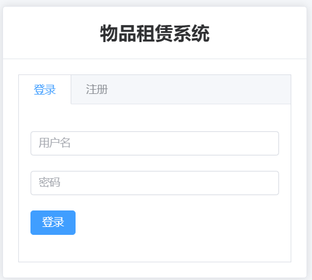
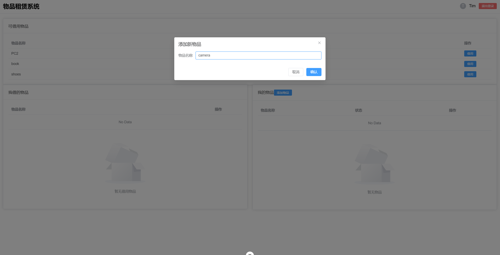
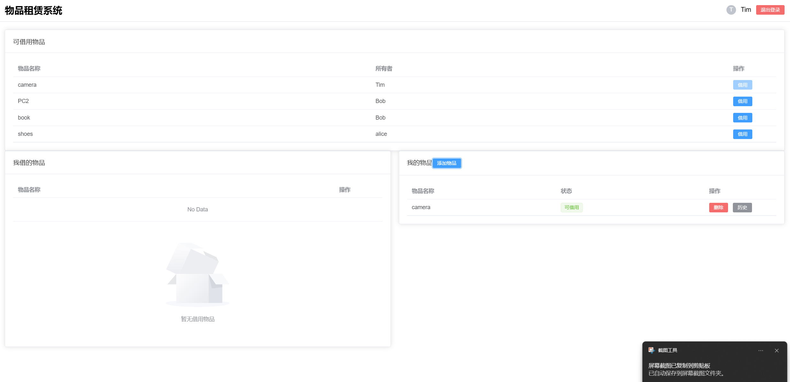
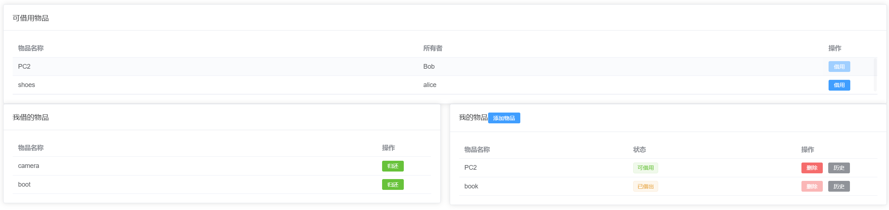
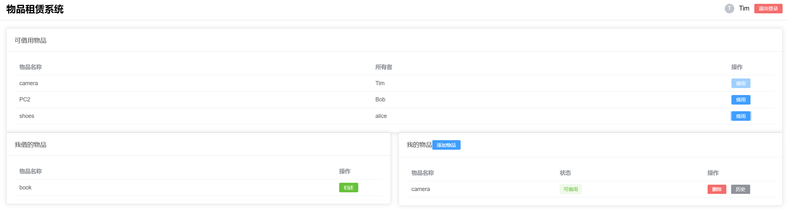
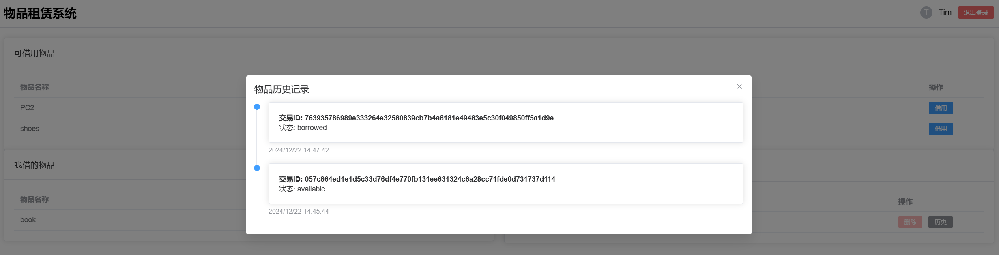

# 许可链DApp物品借还系统文档

## **1. 项目背景**

### **1.1 背景介绍**

- 讨论物品借还系统在社会共享和资源利用中的重要性。
- 指出传统物品借还方式存在的主要问题（信任成本高、记录容易被篡改、资源利用效率低等）。
- 许可链作为基础，通过记录透明性和不可篡改性提高系统信任度和效率。

### **1.2 选题意义**

- **创新性：** 基于区块链技术，采用许可链进行精细化的物品借还管理。
- **实用性：** 适用于社区共享、企业资产管理和教育场景，提供便捷的资源管理方案。
- **社会价值：** 促进社会资源共享，提高资源利用效率，降低信任成本。

------

## **2. 系统设计**

### **2.1 系统架构**

- 系统总体架构分为以下三层：
  1. **用户层：** 提供用户交互界面，包含物品浏览、借用、返还和历史记录查询功能。
  2. **服务层：** 使用 Node.js 提供 API 接口，负责接收前端请求并与区块链交互。
  3. **区块链层：** 基于 Hyperledger Fabric，记录物品信息和借还过程，确保数据的不可篡改性和透明性。
- 流程描述：
  1. 用户通过前端提交操作请求（如借用物品）。
  2. 服务层接收请求并调用对应的链码。
  3. 区块链层完成状态更新，记录借还过程。

### **2.2 功能模块**

- **用户模块：**
  - 用户注册与登录。
- **物品管理模块：**
  - 上架物品：用户提供物品名称、描述、状态等信息。
  - 下架物品：用户可将不再共享的物品移除列表。
  - 查看物品：用户可浏览当前可借用物品清单。
- **借还模块：**
  - 借用物品：记录借用时间、用户信息并更新物品状态为“已借出”。
  - 归还物品：记录归还时间并更新物品状态为“可借用”。
- **历史记录模块：**
  - 查询物品历史：提供物品借还完整记录，包括借用人、时间、状态等。

### **2.3 链码设计**

- **链码功能：**
  - `addItem(itemID, itemName, owner)`：上架新物品，记录物品基本信息。
  - `removeItem(itemID)`：将物品状态设置为不可用，表示物品下架。
  - `borrowItem(itemID, borrower)`：记录物品被借出状态，包括借用人信息和时间。
  - `returnItem(itemID)`：更新物品状态为可借用，同时记录归还时间。
  - `getItemHistory(itemID)`：查询物品的借还记录，包括操作时间和借用人信息。
- **链码示例：**

```javascript
async borrowItem(ctx, itemId, borrower) {
        const itemJSON = await ctx.stub.getState(itemId);
        if (!itemJSON || itemJSON.length === 0) {
            throw new Error(`Item with ID ${itemId} does not exist`);
        }

        const item = JSON.parse(itemJSON.toString());
        if (item.status !== 'available') {
            throw new Error(`Item ${itemId} is not available for borrowing`);
        }

        item.status = 'borrowed';
        item.borrower = borrower;

        await ctx.stub.putState(itemId, Buffer.from(stringify(sortKeysRecursive(item))));
        return JSON.stringify(item);
    }
```

- 数据模型：
  - 物品信息：`{itemId, itemName, owner, status, borrower}`
  - 借还记录：存储在区块链中，通过 `getItemHistory` 查询。

### **2.4 系统交互设计**

- **操作流程：**
  1. 用户登录后，查看当前可借用物品清单。
  2. 用户选择物品后发起借用请求。
  3. 借用记录成功后，系统更新物品状态。
  4. 用户归还物品，系统记录归还时间并更新状态。
- **前后端交互：**
  - 前端通过 REST API 调用服务层接口完成具体操作。
  - 服务层调用链码完成借还记录的上链。

------

## **3. 项目展示**

### **3.1 功能演示**

- **注册与登录：**

  - 用户输入用户名和密码完成注册。

    

- **物品管理：**

  - 用户上架新物品。

    

  - 查看物品列表，筛选当前可用物品。

    

    

    

- **借还操作：**

  - 借用物品：选择物品后发起借用，记录状态更新。

    

  - 归还物品：归还成功后系统自动更新物品状态。

- **历史记录查询：**

  - 用户可查看自己上架的物品借还记录，包括每次操作的详细时间和状态。

    

    

### **3.2 系统界面展示**

- **登录注册界面**：输入用户名密码进行登录、注册。

  

- **主页界面：** 显示可借用物品清单，支持搜索和筛选。

  

- **历史记录界面：** 提供物品的完整借还操作记录。

  

------

## **4. 结论**

### **4.1 项目成果**

- 成功实现了基于许可链的物品借还系统，具备基础功能：
  - 用户管理。
  - 物品上架、下架管理。
  - 借还操作记录。
  - 历史记录查询。
- 系统通过区块链保障数据的安全性和透明性，解决了传统借还系统中信任问题。

### **4.2 未来拓展**

- **功能增强：**
  - 增加用户评价功能，完善物品共享的信任机制。
  - 提供更细化的权限管理功能，例如仅限特定用户群体借用。
- **场景扩展：**
  - 应用于学校实验设备共享系统。
  - 企业内部资产借用管理系统。
  - 社区物资捐赠与共享平台。