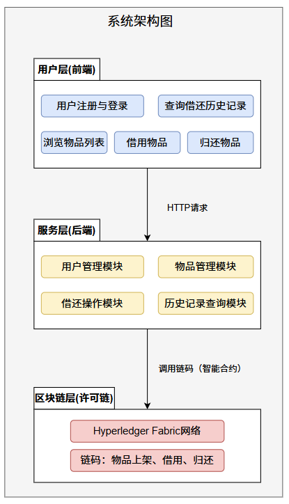
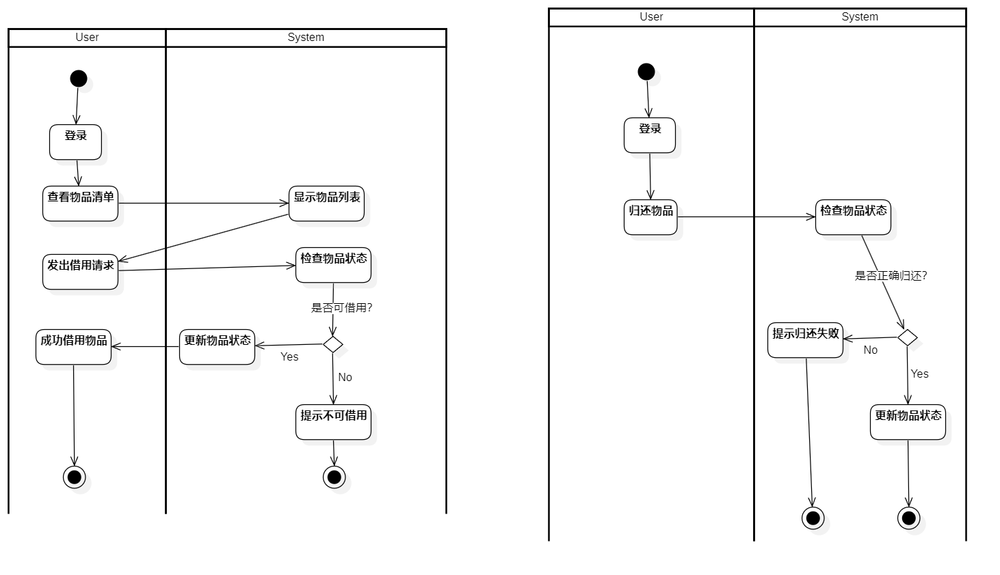

# 许可链DApp物品借还系统文档

## **1. 项目背景**

### **1.1 背景介绍**

在资源共享经济蓬勃发展的今天，物品借还系统正成为促进社会资源高效利用的重要工具。然而，传统物品借还方式存在以下显著问题：

1. **信任成本高：** 借还双方往往需要依赖人工或中心化平台进行信任背书，这既增加了交易复杂性，也可能导致不必要的纠纷。
2. **记录容易被篡改：** 传统的记录方式，如纸质合同或电子表格，缺乏可靠性，无法防止恶意篡改或数据丢失。
3. **资源利用效率低：** 由于缺乏透明的信息共享机制，许多物品未能被合理分配或有效利用。

为了解决上述问题，我们提出基于区块链技术的物品借还系统。通过采用许可链（如 Hyperledger Fabric），系统实现了以下改进：

- **数据透明性：** 借还记录全程上链，确保信息对所有参与者公开透明。
- **不可篡改性：** 区块链技术提供的数据完整性保障，有效防止借还记录的篡改。
- **自动化管理：** 系统通过智能合约自动完成借还流程，减少人工操作，提升效率。

### **1.2 选题意义**

#### **创新性：**  

基于区块链技术，采用许可链（Hyperledger Fabric）进行精细化的物品借还管理，与传统的中心化平台或人工信任背书方式相比，具有显著的技术优势。通过引入区块链不可篡改性和数据透明性，系统构建了一个去中心化的信任机制，确保所有交易记录的完整性和可信度。此外，我们在借还流程过程中应用了智能合约，实现了自动化管理，突破了传统系统在流程繁琐、效率低下方面的限制，体现了技术与应用场景深度结合的创新价值。

#### **实用性：**  

该系统具备广泛的适用场景，包括但不限于社区共享（如居民间工具、书籍的共享借还）、企业资产管理（如办公设备和固定资产的分配与借还）、以及教育场景（如图书馆书籍、实验器材的管理）。系统通过区块链技术优化物品管理流程，为用户提供了透明、高效且便捷的资源管理解决方案，满足了多场景、多主体的实际需求。

#### **社会价值：**  

在资源共享经济快速发展的背景下，该系统通过促进物品的合理分配和高效利用，实现了资源共享的社会价值。一方面，通过区块链技术降低了交易中的信任成本，使得用户无需依赖中心化平台即可安全、便捷地完成借还操作；另一方面，系统的透明性与不可篡改性减少了因信息不对称而引发的纠纷，从而提升了用户体验和信任度。同时，该系统推动了资源循环利用，提高了社会整体的资源使用效率，为实现可持续发展目标提供了技术支持。

------

## **2. 系统设计**

### **2.1 系统架构**

- 系统总体架构分为以下三层：
  1. **用户层：** 提供用户交互界面，包含物品浏览、借用、返还和历史记录查询功能。
  2. **服务层：** 使用 Node.js 提供 API 接口，负责接收前端请求并与区块链交互。
  3. **区块链层：** 基于 Hyperledger Fabric，记录物品信息和借还过程，确保数据的不可篡改性和透明性。
  
- 流程描述：
  1. 用户通过前端提交操作请求（如借用物品）。
  
  2. 服务层接收请求并调用对应的链码。
  
  3. 区块链层完成状态更新，记录借还过程。
  
     

### **2.2 功能模块**

- **用户模块：**
  - 用户注册与登录。
- **物品管理模块：**
  - 上架物品：用户提供物品名称、描述、状态等信息。
  - 下架物品：用户可将不再共享的物品移除列表。
  - 查看物品：用户可浏览当前可借用物品清单。
- **借还模块：**
  - 借用物品：记录借用时间、用户信息并更新物品状态为“已借出”。
  - 归还物品：记录归还时间并更新物品状态为“可借用”。
- **历史记录模块：**
  - 查询物品历史：提供物品借还完整记录，包括借用人、时间、状态等。

### **2.3 链码设计**

- **链码功能：**
  - `addItem(itemID, itemName, owner)`：上架新物品，记录物品基本信息。
  - `removeItem(itemID)`：将物品状态设置为不可用，表示物品下架。
  - `borrowItem(itemID, borrower)`：记录物品被借出状态，包括借用人信息和时间。
  - `returnItem(itemID)`：更新物品状态为可借用，同时记录归还时间。
  - `getItemHistory(itemID)`：查询物品的借还记录，包括操作时间和借用人信息。
- **链码示例：**

```javascript
async borrowItem(ctx, itemId, borrower) {
        const itemJSON = await ctx.stub.getState(itemId);
        if (!itemJSON || itemJSON.length === 0) {
            throw new Error(`Item with ID ${itemId} does not exist`);
        }

        const item = JSON.parse(itemJSON.toString());
        if (item.status !== 'available') {
            throw new Error(`Item ${itemId} is not available for borrowing`);
        }

        item.status = 'borrowed';
        item.borrower = borrower;

        await ctx.stub.putState(itemId, Buffer.from(stringify(sortKeysRecursive(item))));
        return JSON.stringify(item);
    }
```

- 数据模型：
  - 物品信息：`{itemId, itemName, owner, status, borrower}`
  - 借还记录：存储在区块链中，通过 `getItemHistory` 查询。

### **2.4 系统交互设计**

- **操作流程：**
  1. 用户登录后，查看当前可借用物品清单。
  2. 用户选择物品后发起借用请求。
  3. 借用记录成功后，系统更新物品状态。
  4. 用户归还物品，系统记录归还时间并更新状态。
  
  
  
- **前后端交互：**
  
  - 前端通过 REST API 调用服务层接口完成具体操作。
  - 服务层调用链码完成借还记录的上链。

------

## **3. 项目展示**

### **3.1 功能演示**

- **注册与登录：**

  - 用户输入用户名和密码完成注册。

    

- **物品管理：**

  - 用户上架新物品。

    

  - 查看物品列表，筛选当前可用物品。

    

    

    

- **借还操作：**

  - 借用物品：选择物品后发起借用，记录状态更新。

    

  - 归还物品：归还成功后系统自动更新物品状态。

- **历史记录查询：**

  - 用户可查看自己上架的物品借还记录，包括每次操作的详细时间和状态。

    

    

### **3.2 系统界面展示**

- **登录注册界面**：输入用户名密码进行登录、注册。

  

- **主页界面：** 显示可借用物品，我借的物品，我出租的物品。

  

- **历史记录界面：** 提供物品的完整借还操作记录。

  

------

## **4. 结论**

### **4.1 项目成果**

#### **用户管理：**

系统实现了用户注册、登录和权限管理，确保只有授权用户可以访问和操作系统。通过智能合约管理用户身份，确保用户信息的安全性和不可篡改性，提升系统的信任度。

#### **物品上架、下架管理：**

用户可以方便地添加新物品或移除不再共享的物品，保持物品列表的实时更新。采用许可链（Hyperledger Fabric）记录物品的上架和下架操作，确保物品状态的透明性和可追溯性，防止数据被恶意篡改。

#### **借还操作记录：**

系统详细记录每次物品借用和归还的操作，包括时间、用户和物品状态，确保操作的完整性。通过许可链（Hyperledger Fabric）记录每次操作，防止数据篡改，确保记录的真实性和可靠性。

#### **历史记录查询：**

用户可以查询所有物品的借还历史，获取完整的操作记录，方便追踪和管理。通过许可链（Hyperledger Fabric）存储历史记录，确保数据的完整性和透明性，用户可以放心地依赖这些数据。保障数据的安全性和透明性，解决了传统借还系统中的信任问题。

### **4.2 未来拓展**

#### **功能增强：**

增加用户评价功能，完善物品共享的信任机制，帮助用户更好地选择借用物品。
提供更细化的权限管理功能，例如仅限特定用户群体借用，提升系统的灵活性和安全性。
利用智能合约实现复杂的权限管理和用户评价机制，确保规则的自动执行和公平性。

#### **场景扩展：**

应用于学校实验设备共享系统，方便学生和教师管理和共享实验资源。
企业内部资产借用管理系统，提高企业资产的利用率和管理效率。
社区物资捐赠与共享平台，促进社区资源的有效共享和利用。